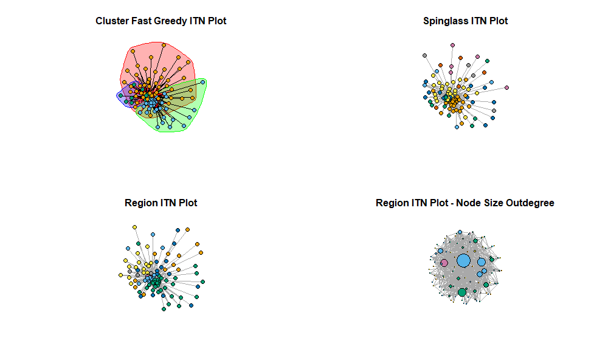
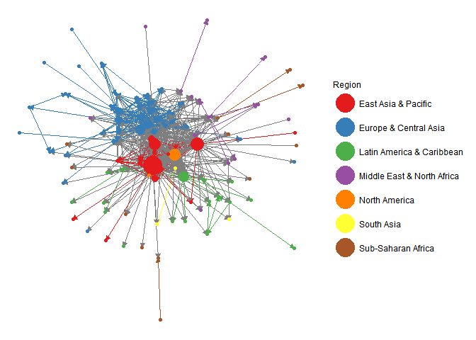
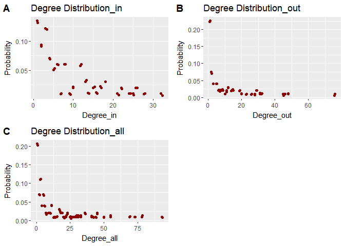
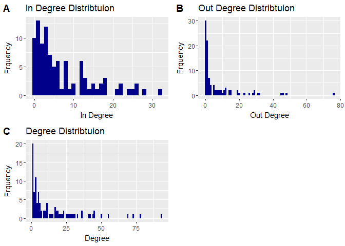
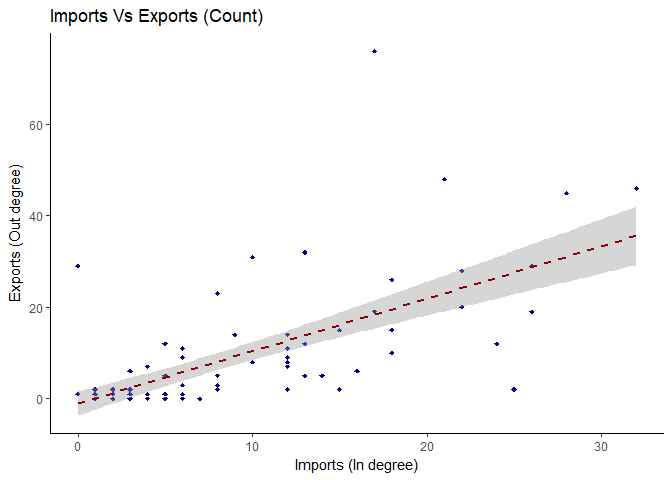
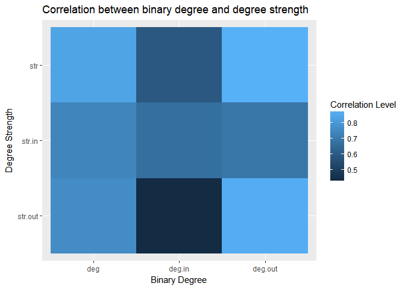
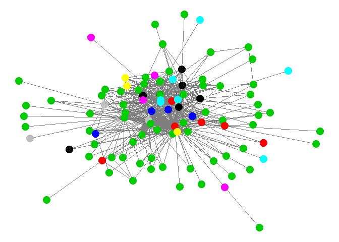

ITNr
================

ITNr - International Trade Network (ITN) analysis in R
======================================================

International trade data can be analysed using a network perspective, where the network is a set of countries linked by weighted and directed trade ties. This network is referred to by various names, the International Trade Network (ITN), World Trade Web (WTW) and the World Trade Network (WTN) etc.
This package provides a number of functions for cleaning and processing international trade data into a network, and undertaking a set of relevant analysis.

Packages
--------

This package uses a number of other packages.

``` r
library(igraph)
library(dplyr)
library(plyr)
library(fastmatch)
library(WDI)
library(ggplot2)
library(GGally)
library(cowplot)
library(intergraph)
library(sna)
library(xergm)
library(ndtv)
library(networkDynamic)
library(tnet)
library(blockmodeling)
library(GoodmanKruskal)
library(reshape2)

#Install this package:
#library(devtools)
#devtools::install_github("MatthewSmith430/ITNr")

library(ITNr)
```

    ## 
    ## Attaching package: 'igraph'

    ## The following objects are masked from 'package:stats':
    ## 
    ##     decompose, spectrum

    ## The following object is masked from 'package:base':
    ## 
    ##     union

    ## 
    ## Attaching package: 'dplyr'

    ## The following objects are masked from 'package:igraph':
    ## 
    ##     as_data_frame, groups, union

    ## The following objects are masked from 'package:stats':
    ## 
    ##     filter, lag

    ## The following objects are masked from 'package:base':
    ## 
    ##     intersect, setdiff, setequal, union

    ## -------------------------------------------------------------------------

    ## You have loaded plyr after dplyr - this is likely to cause problems.
    ## If you need functions from both plyr and dplyr, please load plyr first, then dplyr:
    ## library(plyr); library(dplyr)

    ## -------------------------------------------------------------------------

    ## 
    ## Attaching package: 'plyr'

    ## The following objects are masked from 'package:dplyr':
    ## 
    ##     arrange, count, desc, failwith, id, mutate, rename, summarise,
    ##     summarize

    ## 
    ## Attaching package: 'GGally'

    ## The following object is masked from 'package:dplyr':
    ## 
    ##     nasa

    ## 
    ## Attaching package: 'cowplot'

    ## The following object is masked from 'package:ggplot2':
    ## 
    ##     ggsave

    ## Loading required package: statnet.common

    ## Loading required package: network

    ## network: Classes for Relational Data
    ## Version 1.13.0 created on 2015-08-31.
    ## copyright (c) 2005, Carter T. Butts, University of California-Irvine
    ##                     Mark S. Handcock, University of California -- Los Angeles
    ##                     David R. Hunter, Penn State University
    ##                     Martina Morris, University of Washington
    ##                     Skye Bender-deMoll, University of Washington
    ##  For citation information, type citation("network").
    ##  Type help("network-package") to get started.

    ## 
    ## Attaching package: 'network'

    ## The following object is masked from 'package:plyr':
    ## 
    ##     is.discrete

    ## The following objects are masked from 'package:igraph':
    ## 
    ##     %c%, %s%, add.edges, add.vertices, delete.edges,
    ##     delete.vertices, get.edge.attribute, get.edges,
    ##     get.vertex.attribute, is.bipartite, is.directed,
    ##     list.edge.attributes, list.vertex.attributes,
    ##     set.edge.attribute, set.vertex.attribute

    ## sna: Tools for Social Network Analysis
    ## Version 2.4 created on 2016-07-23.
    ## copyright (c) 2005, Carter T. Butts, University of California-Irvine
    ##  For citation information, type citation("sna").
    ##  Type help(package="sna") to get started.

    ## 
    ## Attaching package: 'sna'

    ## The following objects are masked from 'package:igraph':
    ## 
    ##     betweenness, bonpow, closeness, components, degree,
    ##     dyad.census, evcent, hierarchy, is.connected, neighborhood,
    ##     triad.census

    ## Loading required package: xergm.common

    ## Loading required package: ergm

    ## 
    ## ergm: version 3.6.0, created on 2016-03-24
    ## Copyright (c) 2016, Mark S. Handcock, University of California -- Los Angeles
    ##                     David R. Hunter, Penn State University
    ##                     Carter T. Butts, University of California -- Irvine
    ##                     Steven M. Goodreau, University of Washington
    ##                     Pavel N. Krivitsky, University of Wollongong
    ##                     Martina Morris, University of Washington
    ##                     with contributions from
    ##                     Li Wang
    ##                     Kirk Li, University of Washington
    ##                     Skye Bender-deMoll, University of Washington
    ## Based on "statnet" project software (statnet.org).
    ## For license and citation information see statnet.org/attribution
    ## or type citation("ergm").

    ## NOTE: If you use custom ERGM terms based on 'ergm.userterms'
    ## version prior to 3.1, you will need to perform a one-time update
    ## of the package boilerplate files (the files that you did not write
    ## or modify) from 'ergm.userterms' 3.1 or later. See
    ## help('eut-upgrade') for instructions.

    ## 
    ## Attaching package: 'xergm.common'

    ## The following object is masked from 'package:ergm':
    ## 
    ##     gof

    ## Loading required package: btergm

    ## Package:  btergm
    ## Version:  1.7.6
    ## Date:     2016-06-17
    ## Authors:  Philip Leifeld (University of Glasgow)
    ##           Skyler J. Cranmer (The Ohio State University)
    ##           Bruce A. Desmarais (Penn State University)

    ## Loading required package: tnam

    ## Package:  tnam
    ## Version:  1.6.2
    ## Date:     2016-06-21
    ## Authors:  Philip Leifeld (University of Glasgow)
    ##           Skyler J. Cranmer (The Ohio State University)

    ## Loading required package: rem

    ## Loading required package: GERGM

    ## GERGM: Generalized Exponential Random Graph Models
    ## Version 0.10.0 created on 2016-08-06.
    ## Advanced Development Version: Correlation Networks
    ## copyright (c) 2016, Matthew J. Denny, Penn State University
    ##                     James D. Wilson, University of San Francisco
    ##                     Skyler Cranmer, Ohio State University
    ##                     Bruce A. Desmarais, Penn State University
    ##                     Shankar Bhamidi, University of North Carolina
    ## Type help('gergm') to get started.
    ## Development website: https://github.com/matthewjdenny/GERGM

    ## Package:  xergm
    ## Version:  1.7.3
    ## Date:     2016-06-21
    ## Authors:  Philip Leifeld (University of Glasgow)
    ##           Skyler J. Cranmer (The Ohio State University)
    ##           Bruce A. Desmarais (Pennsylvania State University)
    ## 
    ## Please cite the xergm package in your publications -- see citation("xergm").

    ## Loading required package: networkDynamic

    ## 
    ## networkDynamic: version 0.9.0, created on 2016-01-12
    ## Copyright (c) 2016, Carter T. Butts, University of California -- Irvine
    ##                     Ayn Leslie-Cook, University of Washington
    ##                     Pavel N. Krivitsky, University of Wollongong
    ##                     Skye Bender-deMoll, University of Washington
    ##                     with contributions from
    ##                     Zack Almquist, University of California -- Irvine
    ##                     David R. Hunter, Penn State University
    ##                     Li Wang
    ##                     Kirk Li, University of Washington
    ##                     Steven M. Goodreau, University of Washington
    ##                     Jeffrey Horner
    ##                     Martina Morris, University of Washington
    ## Based on "statnet" project software (statnet.org).
    ## For license and citation information see statnet.org/attribution
    ## or type citation("networkDynamic").

    ## Loading required package: animation

    ## 
    ## ndtv: version 0.10.0, created on 2016-5-6
    ## Copyright (c) 2016, Skye Bender-deMoll, University of Washington
    ##                     with contributions from
    ##                     Martina Morris, University of Washington
    ## Based on "statnet" project software (statnet.org).
    ## For license and citation information see statnet.org/attribution
    ## or type citation("ndtv").

    ## Loading required package: survival

    ## tnet: Analysis of Weighted, Two-mode, and Longitudinal networks.
    ## Type ?tnet for help.

Loading Example Data
--------------------

This package comes with example International Trade Network data. The network data is trade in electrical automotive goods, where this category is defined by Amighini & Gorgoni (2014):
Amighini, A. and Gorgoni, S. (2014) The International Reorganisation of Auto Production, The World Economy, 37(7), pp. 923–952.

These ITNs are igraph objects with a number of attributes (region, GDP, GDP per captia etc). THe edge weights are proportion of global trade in the electrical automtoive goods category group. A threshold has beeen applied to the edge weights so only the most relevant edges and countries are included in th network. Therefore only edges that are at least 0.01% of global trade are included in the network.

The first object is a single network for 2016, the second is a list of networks for 2006 - 2016.

``` r
#Single ITN 2016 
data("ELEnet16")

#List of ITNs 2006 - 2016
data("ELEnetList")
```

Cleaning international trade data
---------------------------------

This function can clean a CSV file downloaded from WITS (<https://wits.worldbank.org/>) and process it into an igraph object with a number of attributes attached. The attributes the function attaches include
- Region
- Income Level
- GDP
- GDP per capita
- GDP growth
- FDI

The network is also weighted, where the weights refer to the proportion of world trade (of the product).

The function requires a number of inputs:
- CSV file name
- Year (as the csv file may contain trade data for multiple years, this therefore allows you to create a ITN for a single year from this CSV file)
- Threshold TRUE/FALSE. TRUE - you want to apply a threshold with a cutoff. FALSE - instead of applying a thrshold you extract the backbone of the network, retaining only statistically signifcant edges.
- Cutoff - for the threshold TRUE this is the cutoff point, for FALSE this is the signficance level for the backbone.

Reference for extracting the backbone of a network: Serrano, M. Á., Boguñá, M. and Vespignani, A. (2009) Extracting the multiscale backbone of complex weighted networks, Proceedings of the National Academy of Sciences, 106(16), pp. 6483–6488.

Below is an example:

``` r
#Example
#Year - 2016
#Threshold - TRUE
#Cutoff - 0.01 (Only ties that are at least 0.01% of world trade are retained)

ITN<-WITSclean("CSV file name.csv",2016,TRUE,0.01)
```

The following functions in the package assume that the ITN specified is one create using the `WITSclean` function.

International Trade Network Plots
---------------------------------

This package contains two functions for plotting the International Trade Networks:
1. Plot set
2. Single Plot

The first produces a panel with four network plots. The purpose of this function for a quick inspection of the network structure, whilst the second plot function provides a better, higher quality plot.

### Plot Set

In the plot set function, the four plots produced include:
- Network plot highlighting clusters using the fast greedy algorithm.
- Network plot with node colours for commnities detected using the spinglass algorithm.
- Network plot with nodes coloured by regional partition. - Network plot with nodes coloured by regional partition and node size based on outdegree centrality.

``` r
library(ITNr)
data("ELEnet16")

ITNplotset(ELEnet16)
```



### Single Plot

This provides a single network plot, where it requires you to specify whether the nodes should be coloured by region and whether labels should be present.

If the nodes are coloured by region, the ties between countries in the same region (intra-regional) are the same colour as the node, and all other ties (inter-regional) are grey.

Node size is based on weighted out degree centrality - so reflects export performance. The edge size is based on the weights of the ties.

In the example below the ITN is coloured by region and the node labels are not present.

``` r
library(ITNr)
data("ELEnet16")

#No labels and node coloured by region
ITN_make_plot(ELEnet16,FALSE,TRUE)
```

    ## Loading required package: scales



Degree Distribtuion
-------------------

We often want to examine the degree distribution of the ITN - that it the distribtuion of import and export ties. We present two plots of the degree distribtuion: probability and histogram.

### Probability Plot

This plot shows the probability of degree scores over the whole network.

``` r
library(ITNr)
data("ELEnet16")

ITNdegdist(ELEnet16)
```



### Histogram Plot

This plot shows the count/number of degree scores over the whole network.

``` r
library(ITNr)
data("ELEnet16")

ITNhistdegdist(ELEnet16)
```



Imports Vs Exports Plot
-----------------------

The following function produces a plot showing imports (in degree) vs exports (out degree). This allows us to identify whether in the ITN, countries that export high levels also import high levels. The plot can be produced for either weighted or binary import and export ties.

``` r
library(ITNr)
data("ELEnet16")

#Plot is for binary imports and exports
ITNimvex(ELEnet16,FALSE)
```



Node Strength - Degree Correlation Plot
---------------------------------------

The following function creates a correlation plot to examine the correlation between node strength and node degree.

``` r
library(ITNr)
data("ELEnet16")

ITNcorr(ELEnet16)
```



Network Analysis
----------------

Initial analysis of the ITN often involves calculating network level properties and calcuting a variety of centrality measures for countries.

### Network Properties

The network level properties calculated for the ITN include:
-Size (number of nodes)
-Density
-Reciprocity
-Diameter
-Average path length
-Average node strength
-Average Degree
-Betweenness Centralisation
-Closeness Centralisation
-Eigenvector Centralisation
-Out Degree Centralisation
-In Degree Centralisation
-All Degree Centralisation
-Clustering coefficent (transitivity)
-Clustering Weighted
-Region Homophily
-Degree Assortativity

``` r
library(ITNr)
data("ELEnet16")

NetProp<-ITNproperties(ELEnet16)

head(NetProp)
```

    ##                       Network.Properties
    ## Size                             99.0000
    ## Density                           0.0747
    ## Reciprocity                       0.4248
    ## Diameter                          0.1726
    ## Average.path.length               2.3190
    ## Average.node.strength             0.9137

### Centrality

We present a function that calculates several centrality metrics for the ITN. These capture the importance of countries in the ITN, with a focus on their export or import performance for the majority of measures.

``` r
library(ITNr)
data("ELEnet16")

CENT<-ITNcentrality(ELEnet16)

head(CENT)
```

    ##     NAMES Weighted.Out.Degree Binary.Out.Degree Weighted.In.Degree
    ## BRA   BRA              0.2783                 5             1.1272
    ## CHN   CHN             22.9228                76             7.1466
    ## COL   COL              0.1680                 6             0.1781
    ## GBR   GBR              0.7155                19             3.3002
    ## HKG   HKG              0.4401                11             5.0964
    ## JPN   JPN              8.7375                32             3.3107
    ##     Binary.In.Degree Weighted.Degree.All Binary.Degree.All Betweenness
    ## BRA               13              0.2783                 5         147
    ## CHN               17             22.9228                76        3426
    ## COL                3              0.1680                 6          61
    ## GBR               26              0.7155                19         156
    ## HKG               12              0.4401                11          87
    ## JPN               13              8.7375                32          33
    ##     Closeness Eigenvector    Hub Authority
    ## BRA    0.2431      0.0542 0.0666    0.6107
    ## CHN    0.3368      0.8780 1.0000    0.6708
    ## COL    0.2377      0.0171 0.0705    0.2149
    ## GBR    0.2886      0.1116 0.4376    0.9139
    ## HKG    0.2495      0.2725 0.2448    0.5447
    ## JPN    0.2847      0.5156 0.7079    0.6096

### Brokerage Roles

It can be important to analyse brokerage roles in the ITN, where we consider a country's role as a broker between various regional partitions. The following function conducts the Gould & Fernandez (1989) brokerage analysis.
Gould, R. V. and Fernandez, R. M. (1989) Structures of mediation: A formal approach to brokerage in transaction networks, Sociological methodology, 19(1989), pp. 89–126.

In this function - you specify the network (igraph object with region attribute) and the name of the file, where the analysis is saved.

``` r
GFbroker<-RegionalBrokerage(ITN,"ITN Regional Brokerage")
```

### Clustering

In the plots section we plotted networks with nodes coloured by clusters. In this function, we present the cluster membership for each country for a variety of cluster algorithms. We also present correlation between cluster membership and regional partitions. This allows you to investigate whether clustering in the ITN occurs at the regional level.

``` r
CLU<-ITNcluster(ELEnet16)
```

### Blockmodels and Structural Equivalence

Blockmodelling and strucutral equivalence are important concepts in international trade. Blockmodels indicates the.
Strucutral equivalence allows us to explore to what extent two coutnries hold equivalent positions in the ITN.
This function gives the block membership for each country and a structural equivalence matrix, which indicates how equivalent pairs of countries are in the ITN.

``` r
blockse<-ITNblock_se(ELEnet16)
```

#### Blockmodel Plot

In addition to calculating the blockmodel membership, we introduce a function to plot the ITN with node coloured by block membership.
You can also set whether you want node labels present(TRUE) or absent (FALSE).

``` r
library(ITNr)
data("ELEnet16")

#No labels 
ITNblock_plot(ELEnet16,FALSE)
```



Longitudinal Network Analysis
-----------------------------

Trade data is availble for decades, therefore longitudnal analysis is also avaiable. Here we present function on how to create a dynamic network object based on a set of (temporal) ITNs (e.g. one ITN for each year).

To create a dynamic network object, we need to specify a list of ITNs. These are usually an ITN for each year, where they are trade in the same product groups across time.

``` r
##Load a list of ITNs - this is 11 ITNs, one for each year for 2006-2016
data("ELEnetList")

##Create a dynamic network object for the list of ITNs
ITNdyn<-ITNdynamic(ELEnetList)

##We can also inspect this dynamic network object
head(as.data.frame(ITNdyn))
```

### Dynamic Network Analysis & Animation

There are many additional packages and functions to analyse this dynamic network object. These are listed at:<http://statnet.csde.washington.edu/workshops/SUNBELT/current/ndtv/ndtv_workshop.html#introduction-to-this-workshop>

Below is some example code to complement this package and analyse the dynamic network ITN object.

#### Film Strip Plots

Film strip plots can be used to create a static plot of a series ofdynamic networks. Below is the code to create a film strip plot from a dynamic network object.

``` r
##Create a dynamic network object for the list of ITNs
ITNdyn<-ITNdynamic(ELEnetList)

par(mar=c(1,1,1,1))

filmstrip(ITNdyn,displaylabels=FALSE,vertex.cex=2,
          edge.col="#CCCCCC55",vertex.col='red')

title("filmstrip example")
```

#### Animation

The dynamic network object can be used to create network animations using the networkDynamic and ndtv packages. There are other tools available to create network animations - that do not use a dynamic network object, see <http://curleylab.psych.columbia.edu/netviz/netviz5.html#/10> for these alternative approaches.

To save the animations different file formats you need to have image magik installed, (<https://www.imagemagick.org/script/index.php>). When installing check the "install legacy programs" box. You also need to installation directory to path in Environment Variables.

``` r
##Create a dynamic network object for the list of ITNs
ITNdyn<-ITNdynamic(ELEnetList)

render.d3movie(ITNdyn,
               render.par=list(tween.frames=20),
               vertex.cex=0.8,
               vertex.col='red',
               edge.col="#CCCCCC55",
               output.mode = 'htmlWidget')

##Commands to save animation as GIF (to insert in presentations)
saveGIF(render.animation(ITNdyn,
                       render.par=list(tween.frames=20),
                       vertex.cex=0.8,vertex.col='red',
                       edge.col="#CCCCCC55"),movie.name = "Example.gif")
```

#### Temporal Metrics

These commands include timeline options, where we can view the dynamics of a network as a timeline by plotting the active spells of edges and vertices.

We can also make use of the `tsna` package to undertake some basic temporal social network analysis. This includes examining how many edges form at each time step for the dynamic network oject (`tEdgeFormation`) and producing a plot of this information. The `tsna` package allows us to compute a time series using network configruation terms (terms specified in the `ergm` package). In the example below the `gtrans` function to calculate and plot transitivity in the networks over time.

``` r
##Create a dynamic network object for the list of ITNs
ITNdyn<-ITNdynamic(ELEnetList)

##Timeline Plots
timeline(ITNdyn)
timeline(ITNdyn,plot.edge.spells=FALSE)

#tsna - Temporal Social Network Analysis
library(tsna)
tEdgeFormation(ITNdyn)
plot(tEdgeFormation(ITNdyn))

tSnaStats(ITNdyn,'gtrans')
plot(tSnaStats(ITNdyn,'gtrans'))
```
